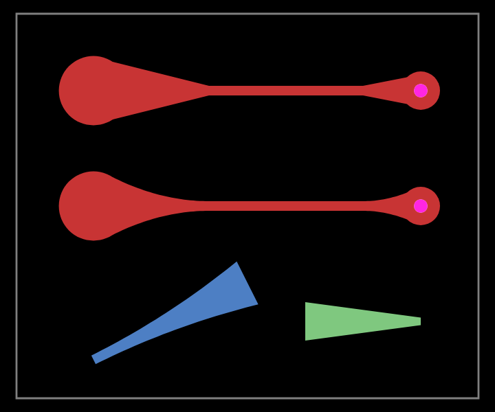

# circuit-to-canvas

Draw [Circuit JSON](https://github.com/tscircuit/circuit-json) into a Canvas- works with any canvas object (Node/Vanilla)

[](https://npmjs.com/package/circuit-to-canvas)

```tsx
const drawer = new CircuitToCanvasDrawer(canvasOrCanvasRenderingContext2d)

// Sets the internal transformation matrix for all operations
drawer.setCameraBounds({ minX: 0, maxX: 100, minY: 0, maxY: 100 })

drawer.configure({
  colorOverrides: {
    topCopper: "#ff0000"
  }
})

// Accepts a circuit json array, by default draws on all layers
drawer.drawElements([pcbPlatedHole], {
  layers: ["top_copper"]
})
```

## Implementation Notes

There are two "types" of layers:

- Specific drawing layers e.g. "top_copper"
- Layer groups "top" (includes "top_copper", "top_soldermask")

inner layers go by the name inner1, inner2 etc.

## Feature Parity with circuit-to-svg

This checklist tracks PCB drawing features from [circuit-to-svg](https://github.com/tscircuit/circuit-to-svg) that are implemented in circuit-to-canvas.

### PCB Elements

- [x] `pcb_board` - Board outline with center/width/height or custom outline
- [x] `pcb_trace` - PCB traces with route points
- [x] `pcb_via` - Via holes
- [x] `pcb_plated_hole` - Plated through-holes (circular, pill, oval shapes)
- [x] `pcb_hole` - Non-plated holes (circular, square, oval shapes)
- [x] `pcb_smtpad` - SMT pads (rect, circle, rotated_rect, pill shapes)
- [x] `pcb_copper_pour` - Copper pour areas (rect, polygon shapes)
- [x] `pcb_cutout` - Board cutouts (rect, circle, polygon shapes)
- [x] `pcb_solder_paste` - Solder paste apertures (opt-in with `drawSolderPaste`)

### Silkscreen Elements

- [x] `pcb_silkscreen_text` - Text on silkscreen layer
- [x] `pcb_silkscreen_rect` - Rectangles on silkscreen
- [x] `pcb_silkscreen_circle` - Circles on silkscreen
- [x] `pcb_silkscreen_line` - Lines on silkscreen
- [x] `pcb_silkscreen_path` - Paths/routes on silkscreen
- [x] `pcb_silkscreen_pill` - Pill shapes (rounded rectangles) on silkscreen

### Copper Text

- [x] `pcb_copper_text` - Text rendered on copper layers (supports knockout mode, mirroring)

### Error Visualization

- [ ] `pcb_trace_error` - Trace routing error indicators
- [ ] `pcb_footprint_overlap_error` - Footprint overlap error indicators

### Debug/Development Features

- [ ] `pcb_component` - Component bounding box visualization
- [ ] `pcb_group` - PCB group visualization with dashed outlines
- [ ] `pcb_courtyard_rect` - Component courtyard rectangles

### Fabrication Notes

- [x] `pcb_fabrication_note_text` - Fabrication note text
- [x] `pcb_fabrication_note_rect` - Fabrication note rectangles
- [x] `pcb_fabrication_note_path` - Fabrication note paths
- [ ] `pcb_fabrication_note_dimension` - Fabrication dimension annotations

### Annotation/Notes

- [x] `pcb_note_text` - General note text
- [x] `pcb_note_rect` - Note rectangles
- [x] `pcb_note_path` - Note paths
- [x] `pcb_note_line` - Note lines
- [x] `pcb_note_dimension` - Dimension annotations

### Panel Support

- [ ] `pcb_panel` - PCB panel outlines for panelization

### Visualization Features

- [ ] Rats nest visualization - Unrouted connection indicators
- [ ] PCB grid overlay - Configurable grid with major/minor lines
- [ ] Soldermask rendering - Soldermask layer visualization
- [ ] Anchor offset indicators - Debug indicators for relative positioning

## Teardrop traces

Teardrops use ordinary `route_type: "wire"` points with optional
`start_width`, `end_width`, and `width_interpolation_mode: "linear" | "quadratic"`.
These fields describe the outgoing segment to the next route point. Supply all
three together and keep `width` equal to `start_width`:

```json
[
  { "route_type": "wire", "x": 0, "y": 0, "layer": "top", "width": 0.6,
    "start_width": 0.6, "end_width": 0.2, "width_interpolation_mode": "quadratic" },
  { "route_type": "wire", "x": 0.8, "y": 0, "layer": "top", "width": 0.2 }
]
```

The incoming segment stays unchanged. The outgoing taper renders as copper with
flat caps, independently of `route_thickness_mode`. Quadratic has concave sides
and flattens into the narrow end; reversing the endpoints and widths preserves
the shape. Tessellation boundary error is at most 1 µm + 1 ppm of width change.

The demo shows linear (upper row), quadratic (middle row), and rotated/bottom
and inner-layer tapers (lower row). No copper pours are needed.



The wire extension is pending publication in Circuit JSON. A small local
compatibility type adds the fields to the published wire type; no git dependency
or unpublished package version is required.
